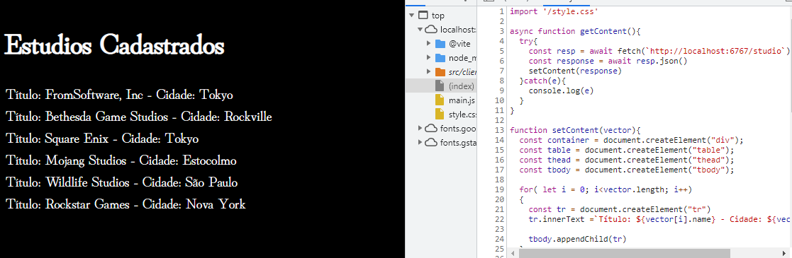

# Lista-games
Consumindo minha API de games e estúdios com fetch e apresentando no front de forma dinâmica.
A partir dessa integração posso ir adicionando novas coisas tanto no front como no back.

